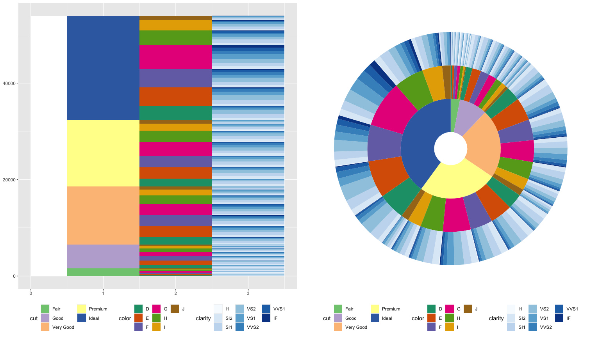
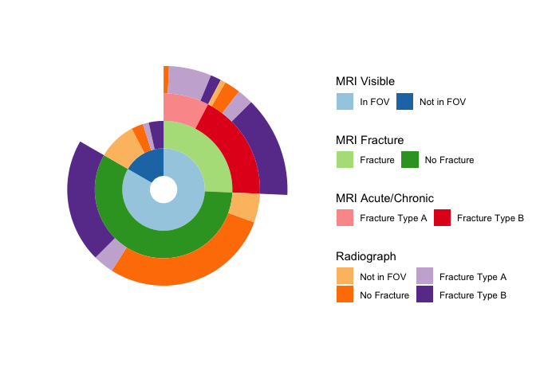

Sunburst Plots in ggplot2
=========================

Inspired by the treatment pathway plots such as

found in [Hripcsak et.
al. (2016)](https://doi.org/10.1073/pnas.1510502113) I set out to build
similar plots, aka, sunburst plots, using
[ggplot2](https://ggplot2.tidyverse.org).

The solution is based on building a plot of rectanges (geom\_rect) and
then displaying the plot using polar coordinates. The
[ggnewscale](https://cran.r-project.org/package=ggnewscale) is used to
streamline the use of multiple fill scales.

The work presented here is initial development work. A more robust and
generic solution is to be developed.

    # needed to build the plots
    library(ggplot2)
    library(ggnewscale)

    # additional packages to make the data manipulation and examples easier
    library(gridExtra)
    library(data.table)

Example 1 : Cut/Color/Clarity of Diamonds
-----------------------------------------

Using the diamonds data set from the ggplot2 package we need to build
three data.frames (I’ll be using data.tables) to summarize the data.

    library(data.table)

    Diamonds <- as.data.table(diamonds)

    sb_0 <- Diamonds[, .(xmin = 0.0, xmax = 0.5, ymin = 0, ymax = .N)]   # Initial Data Set: just count the records
    sb_1 <- Diamonds[, .N, by = c("cut")]                                # Counts by category 1
    sb_2 <- Diamonds[, .N, by = c("cut", "color")]                       # Counts by category 1 and 2
    sb_3 <- Diamonds[, .N, by = c("cut", "color", "clarity")]            # Counts by category 1, 2, and 3

    # insure that the data sets are ordered by category 1, 2, then 3
    setkey(sb_1, cut)
    setkey(sb_2, cut, color)
    setkey(sb_3, cut, color, clarity)

    # set the corners of the rectanges.  xmin/max are set to be one unit apart.
    # cumulative sum of the counts by the categories define the ymin/ymax.
    sb_1[, `:=`(xmin = 0.5, xmax = 1.5, ymin = cumsum(shift(N, fill = 0)), ymax = cumsum(N))]
    sb_2[, `:=`(xmin = 1.5, xmax = 2.5, ymin = cumsum(shift(N, fill = 0)), ymax = cumsum(N))]
    sb_3[, `:=`(xmin = 2.5, xmax = 3.5, ymin = cumsum(shift(N, fill = 0)), ymax = cumsum(N))]

    # build the geom_rect plot
    g_rec <-
      ggplot() +
      aes(xmin = xmin, xmax = xmax, ymin = ymin, ymax = ymax) +
      geom_rect(data = sb_0, fill = "white") +

      # add the layers for the cut
      geom_rect(data = sb_1, mapping = aes(fill = cut)) +
      scale_fill_brewer(type = "qual", palette = 1) +

      # allow for a new fill scale, add the layer for the color by cut
      new_scale("fill") +
      geom_rect(data = sb_2, mapping = aes(fill = color)) +
      scale_fill_brewer(type = "qual", palette = 2) +

      # allow for a new fill scale, add the layer for the clarity by color by cut
      new_scale("fill") +
      geom_rect(data = sb_3, mapping = aes(fill = clarity)) +
      scale_fill_brewer(palette = 1) +

      theme(legend.position = "bottom") +
      guides(fill         = guide_legend(order = 3, nrow = 3),
             fill_new     = guide_legend(order = 2, nrow = 3),
             fill_new_new = guide_legend(order = 1, nrow = 3))

    # build the sunburst plot
    g_sb <-
      g_rec +
      coord_polar(theta = "y") +
      theme_classic() +
      theme(legend.position = "bottom",
            axis.title = element_blank(),
            axis.text  = element_blank(),
            axis.ticks = element_blank(),
            axis.line  = element_blank())

    # display the plots side by side
    grid.arrange(g_rec, g_sb, nrow = 1)

Example 2: Radiographs vs MRI
-----------------------------

The data set which I wanted to summarize with this type of plot was an
assessment if radiographs could be used to detect a specific type of
fracture which is easier to see on an MRI. Each potential fracture was
assessed with the following workflow:

1.  Is the vertebra of interest in the field of view?
    1.  Yes - go to question 2.
    2.  No - end of assessment
2.  If the vertebra of interest is in the field of view:, is there a
    fracture?
    1.  Yes - go to question 3.
    2.  No - end of assessment
3.  If the vertebra is fractured, the fracture of type A or B?

MRI assessments are considered the “gold standard” and the assessments
of the radiographs are compared thereof.

A synthetic data set is generated next:

    set.seed(42)

    # start building the data set with a column marking if the MRI has the vertebra
    # in the field of view
    fractures <- data.table(mri_fov = sample(x = c("In FOV", "Not in FOV"), size = 144, replace = TRUE, prob = c(0.85, 0.15)))

    # for the vertebrae within the field of view, mark as fractured or no fractured
    fractures[
                mri_fov == "In FOV"
              , mri_fracture := sample(x       = c("Fracture", "No Fracture"),
                                       size    = sum(fractures$mri_fov == "In FOV"),
                                       replace = TRUE,
                                       prob    = c(0.37, 0.63))
             ]

    # for the fractured vertebrae, identify the type of fracture
    fractures[
                mri_fracture == "Fracture"
              , mri_type := sample(x       = c("Fracture Type A", "Fracture Type B"),
                                   size    = sum(fractures$mri_fracture == "Fracture", na.rm = TRUE),
                                   replace = TRUE,
                                   prob    = c(0.5, 0.5))
              ]

Radiograph assessments match up with a hierarchy. Only four levels are
needed, 1. Not in fov, 2. No fracture (implies in fov), 3. Fracture Type
A (implies fracture - implies in fov) 3. Fracture Type B (implies
fracture - implies in fov)

Set these levels with different probabilities based on the MRI values

    fractures[
                mri_fov == "Not in FOV"
              , rad_value := sample(x       = c("Not in FOV", "No Fracture", "Fracture Type A", "Fracture Type B"),
                                    size    = sum(fractures$mri_fov == "Not in FOV"),
                                    replace = TRUE,
                                    prob    = c(0.6, 0.3, 0.05, 0.5))
              ]

    fractures[
                mri_fracture == "No Fracture"
              , rad_value := sample(x       = c("Not in FOV", "No Fracture", "Fracture Type A", "Fracture Type B"),
                                    size    = sum(fractures$mri_fracture == "No Fracture", na.rm = TRUE),
                                    replace = TRUE,
                                    prob    = c(0.1, 0.77, 0.07, 0.6))
              ]

    fractures[
                mri_type == "Fracture Type A"
              , rad_value := sample(x       = c("Not in FOV", "No Fracture", "Fracture Type A", "Fracture Type B"),
                                    size    = sum(fractures$mri_type == "Fracture Type A", na.rm = TRUE),
                                    replace = TRUE,
                                    prob    = c(0.05, 0.20, 0.50, 0.25))
              ]

    fractures[
                mri_type == "Fracture Type B"
              , rad_value := sample(x       = c("Not in FOV", "No Fracture", "Fracture Type A", "Fracture Type B"),
                                    size    = sum(fractures$mri_type == "Fracture Type B", na.rm = TRUE),
                                    replace = TRUE,
                                    prob    = c(0.05, 0.10, 0.20, 0.65))
              ]

Set the character vectors to factors

    set(fractures, j = "mri_fov",      value = factor(fractures$mri_fov,      c("In FOV", "Not in FOV")))
    set(fractures, j = "mri_fracture", value = factor(fractures$mri_fracture, c("Fracture", "No Fracture")))
    set(fractures, j = "mri_type",     value = factor(fractures$mri_type,     c("Fracture Type A", "Fracture Type B")))
    set(fractures, j = "rad_value",    value = factor(fractures$rad_value,    c("Not in FOV", "No Fracture", "Fracture Type A", "Fracture Type B")))

Build similar summary data sets as was done in Example 1

    sb_0 <- fractures[, .(xmin = 0, xmax = 0.5, ymin = 0, ymax = .N)]
    sb_1 <- fractures[, .N, by = c("mri_fov")]
    sb_2 <- fractures[, .N, by = c("mri_fov", "mri_fracture")]
    sb_3 <- fractures[, .N, by = c("mri_fov", "mri_fracture", "mri_type")]
    sb_4 <- fractures[, .N, by = c("mri_fov", "mri_fracture", "mri_type", "rad_value")]
    setkey(sb_1, mri_fov)
    setkey(sb_2, mri_fov, mri_fracture)
    setkey(sb_3, mri_fov, mri_fracture, mri_type)
    setkey(sb_4, mri_fov, mri_fracture, mri_type, rad_value)

    sb_1[, `:=`(xmin = 0.5, xmax = 1.5, ymin = cumsum(shift(N, fill = 0)), ymax = cumsum(N))]
    sb_2[, `:=`(xmin = 1.5, xmax = 2.5, ymin = cumsum(shift(N, fill = 0)), ymax = cumsum(N))]
    sb_3[, `:=`(xmin = 2.5, xmax = 3.5, ymin = cumsum(shift(N, fill = 0)), ymax = cumsum(N))]
    sb_4[, `:=`(xmin = 3.5, xmax = 4.5, ymin = cumsum(shift(N, fill = 0)), ymax = cumsum(N))]

    sb_2 <- subset(sb_2, !is.na(mri_fracture))
    sb_3 <- subset(sb_3, !is.na(mri_type))

    g1 <-
      ggplot() +
      aes(xmin = xmin, xmax = xmax, ymin = ymin, ymax = ymax) +
      geom_rect(data = sb_0, fill = "white") +
      geom_rect(data = sb_1, mapping = aes(fill = mri_fov)) +
      scale_fill_manual(name = "MRI Visible", values = c("#a6cee3", "#1f78b4")) +
      new_scale("fill") +
      geom_rect(data = sb_2, mapping = aes(fill = mri_fracture)) +
      scale_fill_manual(name = "MRI Fracture", values = c("#b2df8a", "#33a02c")) +
      new_scale("fill") +
      geom_rect(data = sb_3, mapping = aes(fill = mri_type)) +
      scale_fill_manual(name = "MRI Acute/Chronic", values = c("#fb9a99", "#e31a1c")) +
      new_scale("fill") +
      geom_rect(data = sb_4, mapping = aes(fill = rad_value)) +
      scale_fill_manual(name = "Radiograph", values = c("#fdbf6f", "#ff7f00", "#cab2d6", "#6a3d9a")) +
      theme(legend.position = "bottom") +
      coord_polar(theta = "y") +
      theme_classic() +
      theme(axis.title = element_blank(),
            axis.text  = element_blank(),
            axis.ticks = element_blank(),
            axis.line  = element_blank()) +
      guides(fill             = guide_legend(order = 4, ncol = 2),
             fill_new         = guide_legend(order = 3, ncol = 2),
             fill_new_new     = guide_legend(order = 2, ncol = 2),
             fill_new_new_new = guide_legend(order = 1, ncol = 2))
    g1

A different version of this graphic can be built with less white space
between the rings. The above graphic has the advantage of each ring
holding one level of data. In the below we move parts of the radiograph
ring to lower levels when there is missing data below, e.g., when the
vertebrae are not in the MRI FOV.

    sb_4[is.na(mri_type),     `:=`(xmin = xmin - 1, xmax = xmax - 1)]
    sb_4[is.na(mri_fracture), `:=`(xmin = xmin - 1, xmax = xmax - 1)]
    g1

Session Info
============

    sessionInfo()

    ## R version 4.0.0 (2020-04-24)
    ## Platform: x86_64-apple-darwin17.0 (64-bit)
    ## Running under: macOS Catalina 10.15.5
    ## 
    ## Matrix products: default
    ## BLAS:   /Library/Frameworks/R.framework/Versions/4.0/Resources/lib/libRblas.dylib
    ## LAPACK: /Library/Frameworks/R.framework/Versions/4.0/Resources/lib/libRlapack.dylib
    ## 
    ## locale:
    ## [1] en_US.UTF-8/en_US.UTF-8/en_US.UTF-8/C/en_US.UTF-8/en_US.UTF-8
    ## 
    ## attached base packages:
    ## [1] stats     graphics  grDevices utils     datasets  methods   base     
    ## 
    ## other attached packages:
    ## [1] data.table_1.12.8 gridExtra_2.3     ggnewscale_0.4.1  ggplot2_3.3.2    
    ## 
    ## loaded via a namespace (and not attached):
    ##  [1] knitr_1.29         magrittr_1.5       tidyselect_1.1.0   munsell_0.5.0     
    ##  [5] colorspace_1.4-1   R6_2.4.1           rlang_0.4.6        stringr_1.4.0     
    ##  [9] dplyr_1.0.0        tools_4.0.0        grid_4.0.0         gtable_0.3.0      
    ## [13] xfun_0.15          withr_2.2.0        htmltools_0.5.0    ellipsis_0.3.1    
    ## [17] digest_0.6.25      tibble_3.0.1       lifecycle_0.2.0    crayon_1.3.4      
    ## [21] farver_2.0.3       RColorBrewer_1.1-2 purrr_0.3.4        vctrs_0.3.1       
    ## [25] glue_1.4.1         evaluate_0.14      rmarkdown_2.3      labeling_0.3      
    ## [29] stringi_1.4.6      compiler_4.0.0     pillar_1.4.4       generics_0.0.2    
    ## [33] scales_1.1.1       pkgconfig_2.0.3

Bibtex References
=================

    @Article {,
       author = {Hripcsak, George and Ryan, Patrick B. and Duke, Jon D. and Shah, Nigam H. and Park, Rae Woong and Huser, Vojtech and Suchard, Marc A. and Schuemie, Martijn J. and DeFalco, Frank J. and Perotte, Adler and Banda, Juan M. and Reich, Christian G. and Schilling, Lisa M. and Matheny, Michael E. and Meeker, Daniella and Pratt, Nicole and Madigan, David},
       title = {Characterizing treatment pathways at scale using the OHDSI network},
       volume = {113},
       number = {27},
       pages = {7329--7336},
       year = {2016},
       doi = {10.1073/pnas.1510502113},
       publisher = {National Academy of Sciences},
       abstract = {Observational research promises to complement experimental research by providing large, diverse populations that would be infeasible for an experiment. Observational research can test its own clinical hypotheses, and observational studies also can contribute to the design of experiments and inform the generalizability of experimental research. Understanding the diversity of populations and the variance in care is one component. In this study, the Observational Health Data Sciences and Informatics (OHDSI) collaboration created an international data network with 11 data sources from four countries, including electronic health records and administrative claims data on 250 million patients. All data were mapped to common data standards, patient privacy was maintained by using a distributed model, and results were aggregated centrally. Treatment pathways were elucidated for type 2 diabetes mellitus, hypertension, and depression. The pathways revealed that the world is moving toward more consistent therapy over time across diseases and across locations, but significant heterogeneity remains among sources, pointing to challenges in generalizing clinical trial results. Diabetes favored a single first-line medication, metformin, to a much greater extent than hypertension or depression. About 10\% of diabetes and depression patients and almost 25\% of hypertension patients followed a treatment pathway that was unique within the cohort. Aside from factors such as sample size and underlying population (academic medical center versus general population), electronic health records data and administrative claims data revealed similar results. Large-scale international observational research is feasible.},
       issn = {0027-8424},
       URL = {https://www.pnas.org/content/113/27/7329},
       eprint = {https://www.pnas.org/content/113/27/7329.full.pdf},
       journal = {Proceedings of the National Academy of Sciences}
     }
